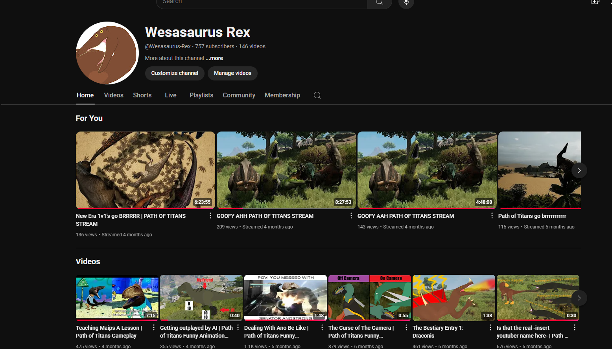
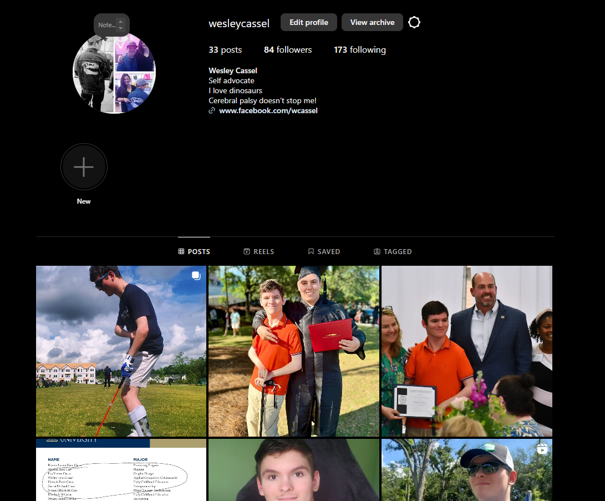
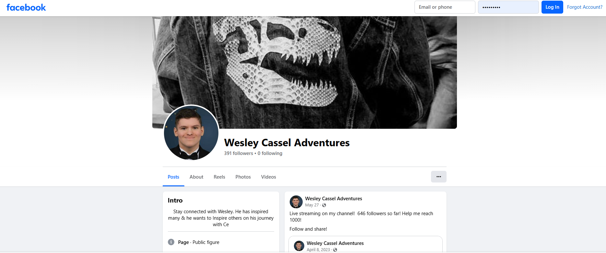
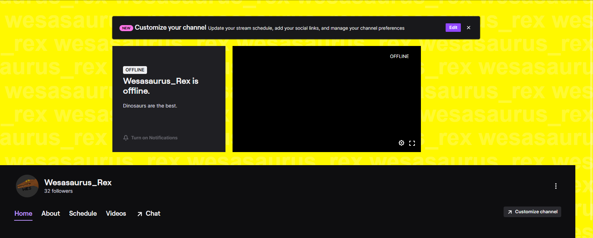

[Back to Portfolio](./)

Personal Website
===============

-   **Class:** Applied Networking 
-   **Grade:** A
-   **Language(s):** HTML
-   **Source Code Repository:** [Personal Website](https://github.com/Wesasaurus/Applied-Networking-CSCI-332)  
    (Please [email me](mailto:wlcassel@csustudent.net?subject=GitHub%20Access) to request access.)

## Project description

The goal of this project was to use the Apache Server Product to host a server webpage. After which I had to make a presentation on the process and what I learned.

## How to compile and run the program
```
Install Apache24 through the following link: https://www.apachelounge.com/download/
Make sure the index file is in the htdocs folder
In the command prompt, navigate to Apache24/bin and type the following command: httpd
Go to localhost via typing 127.0.0.1 in a browser of your choice
```
## UI Design

As seen in figure 1, the website has a couple images and links to click on. Upon clicking on the "Video Walkthrough of Page and How It Was Made" the website would take you to a youtube video of how the website was made; however, that video has since been taken down. Figure 2-5 showcases what happens when clicking upon specific links such as the Youtube link. The final image animated image is a clickable video thumbnail that will bring you to one of the videos I made upon clicking it.

  
Fig 1. The launch screen

  
Fig 2. showcases what happens when clicking upon the Youtube link.

  
Fig 3. showcases what happens when you click upon the Instagram link.

  
Fig 4. showcases what happens when you click upon the Facebook link.

  
Fig 5. showcases what happens when you click upon the Twitch link.


## 3. Additional Considerations

Access to the video that was taken down will be available in the Github.

[Back to Portfolio](./)
