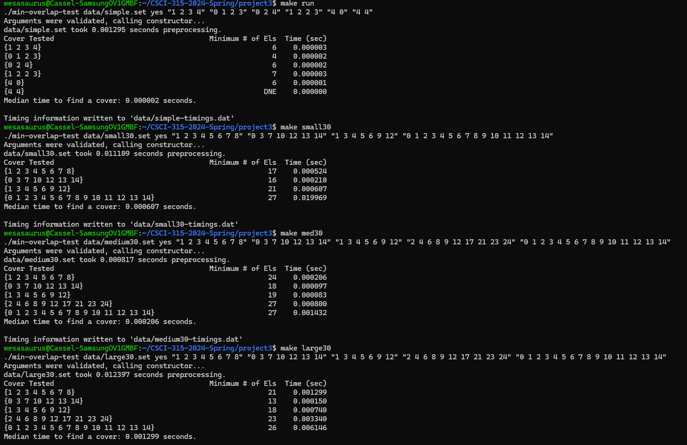
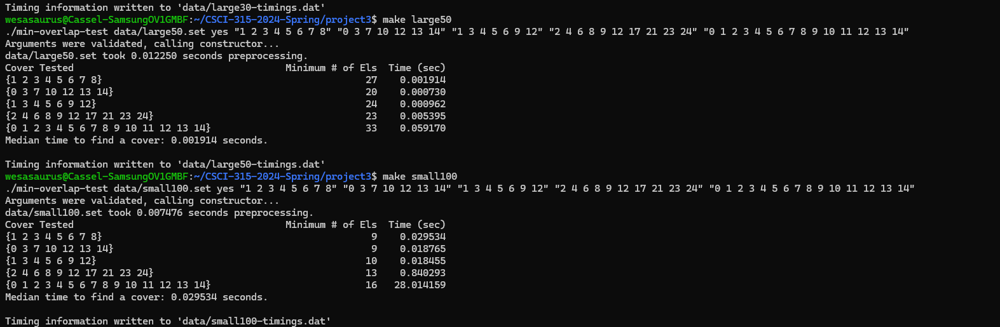
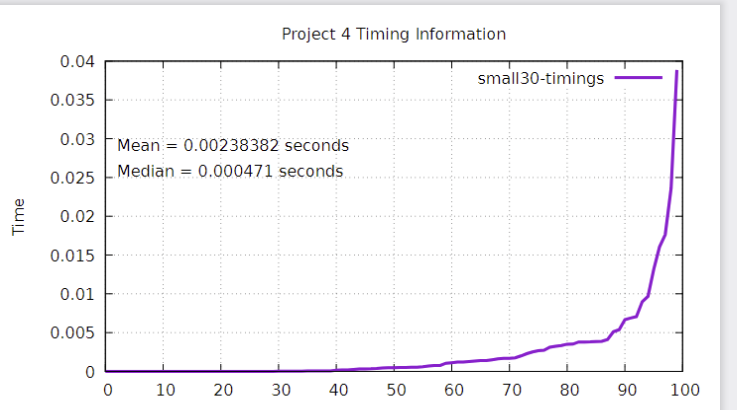
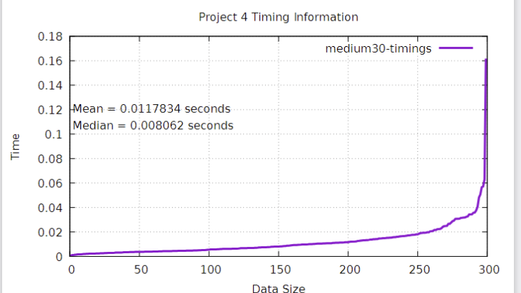

[Back to Portfolio](./)

Minimum Overlap Coverage Project
===============

-   **Class:** Data Structure Analysis CSCI 315
-   **Class Grade:** C
-   **Project Grade:** 125/100
-   **Language(s):** C++
-   **Source Code Repository:** [Minimum Overlap Coverage](https://github.com/Wesasaurus/Project-3)  
    (Please [email me](mailto:wlcassel@csustudent.net?subject=GitHub%20Access) to request access.)

## Project description

The goal of this project is to create a program that will find the Minimum Overlap of sets that cover all points and to do so as quickly and efficiently as possible.

## How to compile and run the program

First, Ubuntu 22.04.3 LTS must be installed on the device for the program to run.

Upon installing Ubuntu you will need to get the repository made within Ubuntu.

After which you will go to the project 3 folder.

Use make min-overlap-test to compile the program.

After compiling, there are a multitude of commands you can run to test the program. These include: make run, make small30, make med30, make large30, make large50, make small100, make small-timings, make medium-timings, and make large-timings.

## UI Design

The following screenshots are the results of using the commands to run the program.

  
Fig 1. Example output of make run, small30, med30, and large30

  
Fig 2. Example output of make large50 and small100

  
Fig 3. Example output of make small-timings

  
Fig 4. Example output of make medium-timings

  
Fig 5. Example output of make large-timings

## 3. Additional Considerations

Heres access to the github release: https://github.com/Wesasaurus/Project-3/releases/tag/V1.0

[Back to Portfolio](./)
