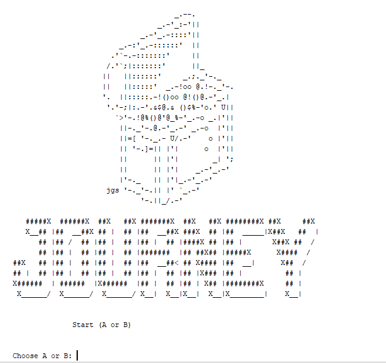
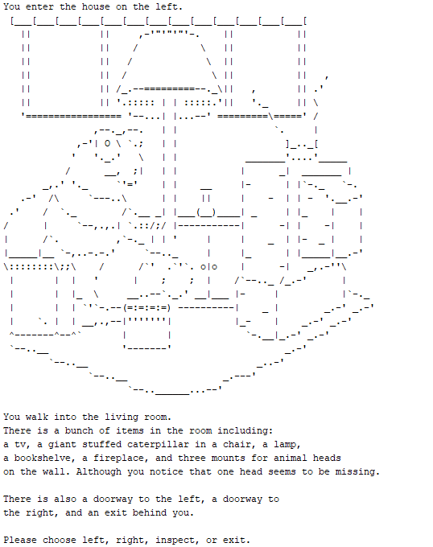
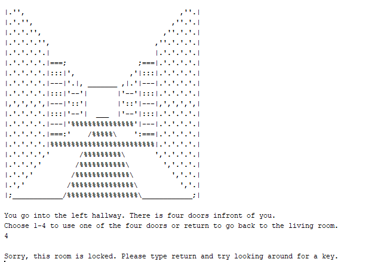
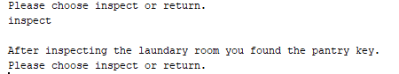
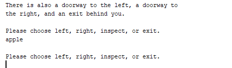
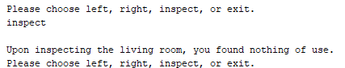
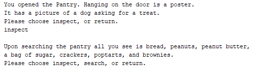

[Back to Portfolio](./)

Choose Your Own Adventure Story Game
===============

-   **Class:** Object Oriented Programming
-   **Class Grade:** A
-   **Project Grade:** A
-   **Language(s):** Java
-   **Source Code Repository:** [Choose Your Own Adventure](https://github.com/Wesasaurus/CSCI-325-Fall23-AdventureStoryGame)  
    (Please [email me](mailto:wlcassel@csustudent.net?subject=GitHub%20Access) to request access.)

## Project description

This project is a choose your own adventure game where you can choose different paths to get different outcomes or experience different things along each path. 

## How to compile and run the program

Make sure you have Apache Netbeans Installed as it is necessary to run the program.

After installing Apache Netbeans, click open project and click on choose your own adventure.

Once the project opens press Run project at the top.

## UI Design

Since this project was a group project, each member did a major path. You will be greeted with the game name and a choice (figure 1). In order to reach the path I did, once you open the program pick the following choices: A, B, A, A, and D. After which you will get into my part of the game. You will known it based on the giant catapiller shown (figure 2) My game consists of multiple features. One is locked doors (figure 3). You will have to find keys throughout the house in order to unlock doors (figure 4). Their is also puzzles. I won't show the solutions to the puzzle but I will include a screenshot of one of them (figure 7). There is also code to ensure valid input (figure 5). You can also use one of the inputs to inspect rooms to gain more detail about them (figure 6). 

  
Fig 1. The launch screen

  
Fig 2. The start of my choose your own adventure routes

  
Fig 3. Example of a Locked Door

  
Fig 4. Example of finding a key to a room

  
Fig 5. What happens when invalid input occurs

  
Fig 6. Example of inspecting a room

  
Fig 7. Example of a puzzle to solve in the game

## 3. Additional Considerations

There are other paths not made by me, as this was a collaborative game; however, after the into decisions of A, B, A, A, D you reach my part of the game.

Here is the link to the release: https://github.com/Wesasaurus/CSCI-325-Fall23-AdventureStoryGame/releases/tag/V1.0

[Back to Portfolio](./)
