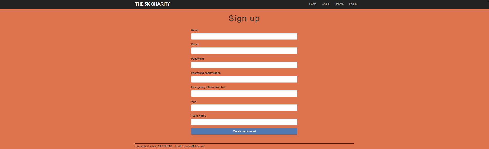
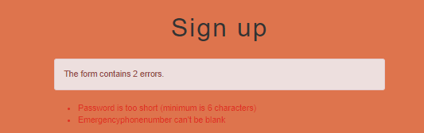
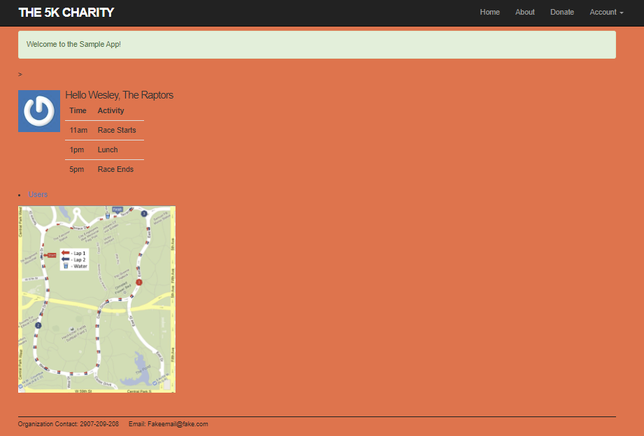
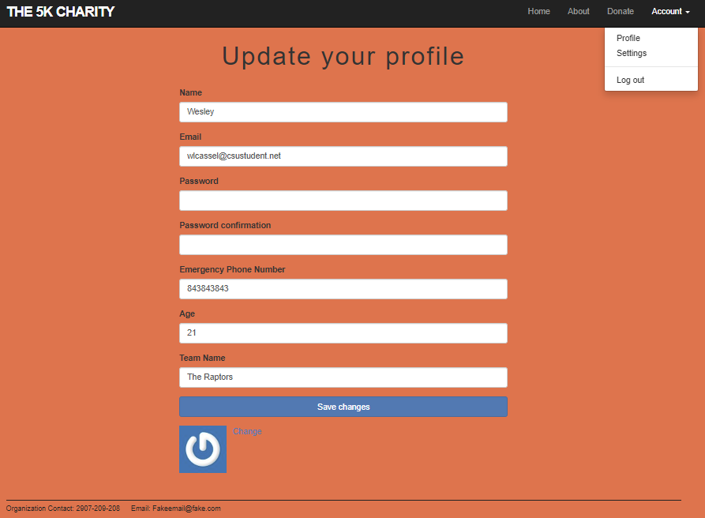
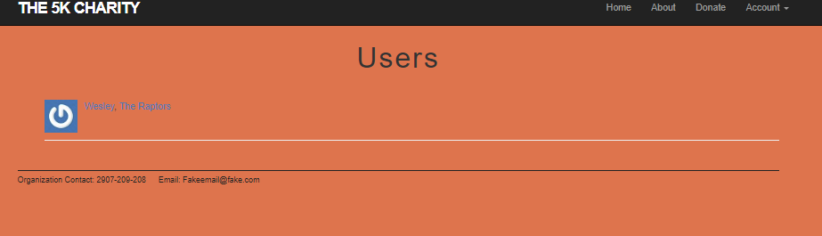

[Back to Portfolio](./)

Ruby on Rails 5K Charity
===============

-   **Class:** User Interface Programming
-   **Class Grade:** B
-   **Project Grade:** A
-   **Language(s):** Ruby on Rails
-   **Source Code Repository:** [Ruby on Rails 5K Charity](https://github.com/User-interface-Programming-Class/UserInterfaceFinal)  
    (Please [email me](mailto:wlcassel@csustudent.net?subject=GitHub%20Access) to request access.)

## Project description

This is a group project made with the goal of producing a functioning website that could in theory be used by a 5k Charity foundation. The project includes multiple features such as pages with information on the race, places to login, different charts and information showing depending on if a racer is logged in.

## How to compile and run the program

Make sure you have a version of Ubuntu installed to start the app

To get started with the app, clone the repo and then install the needed gems:

```
$ gem install bundler -v 2.3.14
$ bundle _2.3.14_ config set --local without 'production'
$ bundle _2.3.14_ install
```

Next, migrate the database:

```
$ rails db:migrate
```

Run the app in the local server:

```
$ rails server
```
Once rails server is entered, navigate to 127.0.0.1:3000 on your prefered browser or clink the link shown on the rails server command.

## UI Design

Going through this program there is a few functions that can be seen. As seen in figures 3 - 5, and figure 8, there are fields that allow user input. This user input can be used for many things such as donating money (figure 3) or creating an account (figure 5). Other features include popups for when inputs are not properly entered (figure 6). There are also links to other pages used throughout as shown when you click about (figure 2), or the users page after logging in (figure 7 and figure 9). You also are only shown your teammates in the users page.

  
Fig 1. The launch screen

  
Fig 2. Navigating to the About Page

  
Fig 3. The Donate page and its field of input

  
Fig 4. The Login page and its field of input

  
Fig 5. The Sign Up page and its field of input

  
Fig 6. What happens when invalid input occurs

  
Fig 7. The page that a user is directed to after successful login or account creation

  
Fig 4. The settings page and account options. Allows user to change profile picture and other information.

  
Fig 9. The Users page. Lets racers see their teammates. Admins can see all teams.

## 3. Additional Considerations

Heres access to the github release:
https://github.com/User-interface-Programming-Class/UserInterfaceFinal/releases/tag/v1.0

[Back to Portfolio](./)
