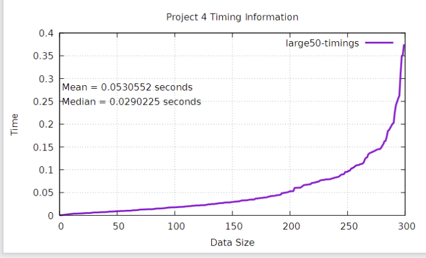
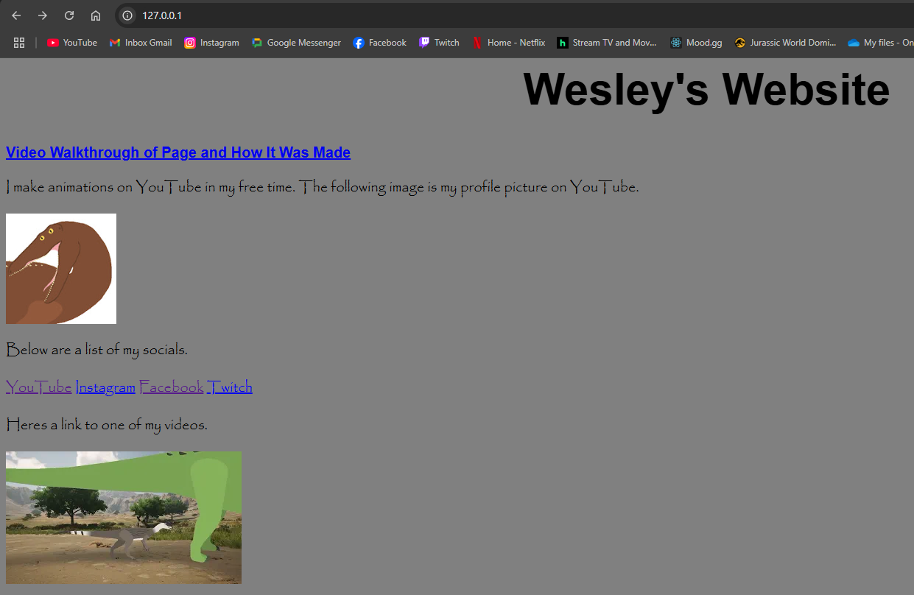
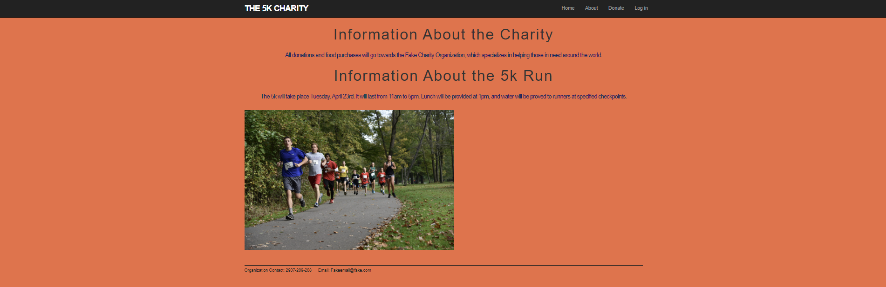

Portfolio
=========

Programming Projects
--------------------

*For access to my private project repositories, please [email me](mailto:wlcassel@csustudent.net?subject=GitHub%20Access) with the subject line, GitHub Access.

---
### [Minimum Coverage Overlap | CSCI 315](DataStructureAnalysis.md)

---
### [Choose Your Own Adventure Story Game | CSCI 325](ObjectOrientedProgramming.md)

---
### [Personal Website | CSCI 332](AppliedNetworking.md)

---
### [Ruby on Rails 5K Charity | CSCI 334](UserInterfaceProgramming.md)

---

Ethics Papers
-------------

### [Important Notification or a Disruptive Distraction](/pdf/Procedural Programming Ethics Paper.docx)

-   **Class:** Procedural Programming
-   **Grade:** A

### [Ethical Challenges in Cybersecurity](/pdf/Object Oriented Ethics Paper.docx)

-   **Class:** Object Oriented Programming
-   **Grade:** A

### [The Ethics of Copied Code](/pdf/Survey of Scripting Ethics Essay.docx)

-   **Class:** Survey of Scripting Languages
-   **Grade:** A

---

Presentations
-------------

### [Trends in Cyber Crime](/pdf/Cybersecurity Powerpoint.pptx)

- **Class:** Principles of Cybersecurity
- **Grade:** A

### [Automotive Information System Security Vulnerabilities](/pdf/Cybersecurity Powerpoint 2.pptx)

- **Class:** Principles of Cybersecurity
- **Grade:** A

---

Page template forked from <a href="https://github.com/csu-cs/csci-portfolio">CSU-CS</a>

<!-- Remove above link if you don't want to attributive -->
